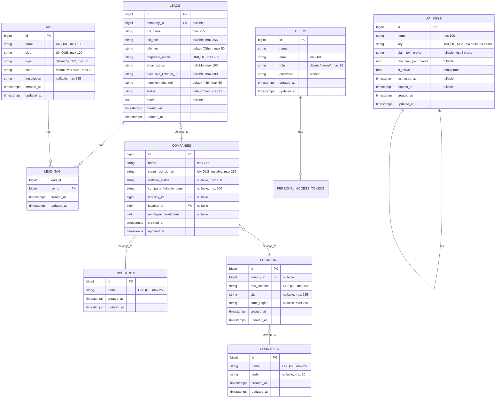

# Database Schema & Data Model

> **Audience**: Developers working on migrations, queries, or data imports.
>
> **Database Engines**: SQLite (local + Hostinger), PostgreSQL (Render staging), MySQL (CI tests + optional Hostinger)

---

## Entity-Relationship Diagram



---

## Table Reference

### `leads`

The core table. Each row is one person/contact scraped or imported into the system.

| Column | Type | Constraints | Description |
|---|---|---|---|
| `id` | bigint | PK, auto-increment | Unique lead identifier |
| `company_id` | bigint | FK → companies.id, nullable, null on delete | Link to the company this person works at |
| `full_name` | varchar(255) | NOT NULL | Person's full name |
| `job_title` | varchar(255) | nullable | Job title (e.g., "Deputy CEO") |
| `title_tier` | varchar(50) | default `'Other'` | Seniority classification: `C-Level`, `VP-Level`, `Director-Level`, `Other` |
| `corporate_email` | varchar(255) | UNIQUE, NOT NULL | Work email — **the unique identifier for deduplication** |
| `email_status` | varchar(100) | nullable | Verification result (freeform, e.g., "✅ Valid email") |
| `executive_linkedin_url` | varchar(500) | nullable | LinkedIn profile URL |
| `ingestion_channel` | varchar(50) | default `'n8n'` | How this lead entered the system: `n8n`, `manual`, `api`, `csv_import` |
| `status` | varchar(20) | default `'new'` | Pipeline status: `new`, `reviewed`, `qualified`, `rejected` |
| `notes` | text | nullable | Free-text notes |
| `created_at` | timestamp | auto | When the lead was created |
| `updated_at` | timestamp | auto | When the lead was last modified |

**Indexes**: `full_name`, `title_tier`, `status`, `ingestion_channel`, `created_at` (plus unique index on `corporate_email` and primary index on `id`).

> [!TIP]
> **Bulk Query Performance**: The bulk delete and bulk tag services rely directly on these indexes:
> - `id` (PK) for explicit ID and `whereBetween` range queries (`id_ranges`).
> - `corporate_email` (Unique Index) for exact email arrays and domain matching.
> - `status`, `ingestion_channel`, and `created_at` for compound filtering and date range cleanups.
> - Foreign key constraint `cascadeOnDelete` on `lead_tag.lead_id` ensures pivot tag cleanup is atomic. Deleting leads preserves company, location, and industry records.

---

### `companies`

Normalized company records. Multiple leads can share one company (deduped by `clean_root_domain` then `name`).

| Column | Type | Constraints | Description |
|---|---|---|---|
| `id` | bigint | PK | |
| `name` | varchar(255) | NOT NULL | Company name |
| `clean_root_domain` | varchar(255) | UNIQUE, nullable | Root domain with protocol/www stripped (e.g., `al-sydbank.dk`) |
| `website_status` | varchar(100) | nullable | HTTP status check result (freeform) |
| `company_linkedin_page` | varchar(500) | nullable | Company LinkedIn URL |
| `industry_id` | bigint | FK → industries.id, nullable | |
| `location_id` | bigint | FK → locations.id, nullable | |
| `employee_headcount` | unsigned int | nullable | Number of employees |
| `created_at` / `updated_at` | timestamps | auto | |

**Indexes**: `name`, `employee_headcount`

---

### `industries`

Lookup table for industry names. Auto-created when a new industry is encountered during ingestion.

| Column | Type | Constraints |
|---|---|---|
| `id` | bigint | PK |
| `name` | varchar(255) | UNIQUE |
| `created_at` / `updated_at` | timestamps | |

---

### `countries`

Lookup table for country names. Auto-extracted from `HQ Location` (last comma-separated part).

| Column | Type | Constraints |
|---|---|---|
| `id` | bigint | PK |
| `name` | varchar(255) | UNIQUE |
| `code` | varchar(10) | nullable (ISO code, not always populated) |
| `created_at` / `updated_at` | timestamps | |

---

### `locations`

Parsed location data from the `HQ Location` field.

| Column | Type | Constraints | Description |
|---|---|---|---|
| `id` | bigint | PK | |
| `country_id` | bigint | FK → countries.id, nullable | |
| `raw_location` | varchar(500) | UNIQUE | Original location string as received |
| `city` | varchar(255) | nullable | Parsed first part of location |
| `state_region` | varchar(255) | nullable | Parsed second part of location |
| `created_at` / `updated_at` | timestamps | | |

**How locations are parsed**: `"Aabenraa, Southern Denmark, Denmark"` → city: `Aabenraa`, state_region: `Southern Denmark`, country: `Denmark`

---

### `tags`

Labels that can be attached to leads. Two types: `public` (user-facing) and `system` (developer/test use).

| Column | Type | Constraints | Description |
|---|---|---|---|
| `id` | bigint | PK | |
| `name` | varchar(100) | UNIQUE | Display name (e.g., "High Priority") |
| `slug` | varchar(100) | UNIQUE | URL-safe version (e.g., "high-priority"). Auto-generated. |
| `type` | varchar(50) | default `'public'` | `public` or `system` |
| `color` | varchar(20) | default `'#64748b'` | Hex color for UI badges |
| `description` | varchar(255) | nullable | Explanation of what this tag means |
| `created_at` / `updated_at` | timestamps | | |

**Pre-seeded tags**:

| Name | Slug | Type | Color | Purpose |
|---|---|---|---|---|
| Test | `test` | system | `#ef4444` (red) | Automated test leads |
| Demo | `demo` | system | `#f59e0b` (amber) | Demonstration data |
| Sample | `sample` | system | `#64748b` (slate) | Initial sample data |
| VIP | `vip` | public | `#10b981` (emerald) | High-value prospects |
| High Priority | `high-priority` | public | `#8b5cf6` (violet) | Urgent follow-up |
| Q3 Campaign | `q3-campaign` | public | `#06b6d4` (cyan) | Q3 outreach batch |

**Auto-creation**: Tags sent during lead ingestion that don't exist yet are automatically created with:
- `slug` generated from the name (e.g., "Hot Lead" → `hot-lead`)
- `type` defaults to `public` (except `test`, `demo`, `sample` which auto-map to `system`)
- `color` defaults to `#3b82f6` (blue) for public, `#ef4444` (red) for system

---

### `lead_tag` (Pivot Table)

Many-to-many relationship between leads and tags.

| Column | Type | Constraints |
|---|---|---|
| `lead_id` | bigint | FK → leads.id, CASCADE ON DELETE |
| `tag_id` | bigint | FK → tags.id, CASCADE ON DELETE |
| `created_at` / `updated_at` | timestamps |

**Primary key**: Composite `(lead_id, tag_id)` — a lead can't have the same tag twice.

---

### `users`

Dashboard user accounts. Currently minimal — just admin users for dashboard access.

| Column | Type | Constraints | Description |
|---|---|---|---|
| `id` | bigint | PK | |
| `name` | varchar | NOT NULL | Display name |
| `email` | varchar | UNIQUE | Login email |
| `role` | varchar(20) | default `'viewer'` | `admin` or `viewer` |
| `password` | varchar | hashed (bcrypt) | |
| `created_at` / `updated_at` | timestamps | | |

**Default admin** (created by `AdminUserSeeder`): `admin@leadsboard.local` / `password`

---

### `api_keys`

API keys for external consumer access with per-key rate limiting.

| Column | Type | Constraints | Description |
|---|---|---|---|
| `id` | bigint | PK | |
| `name` | varchar(100) | NOT NULL | Human-readable label (e.g., "n8n-production") |
| `key` | varchar(64) | UNIQUE | SHA-256 hash of the actual key |
| `plain_text_prefix` | varchar(8) | nullable | First 8 chars of the key for visual identification |
| `rate_limit_per_minute` | unsigned int | nullable | `null` = use system default (120), `0` = unlimited, `N` = N requests/min |
| `is_active` | boolean | default `true` | Can be deactivated without deletion |
| `last_used_at` | timestamp | nullable | Last time this key was used |
| `expires_at` | timestamp | nullable | Optional expiration date |
| `created_at` / `updated_at` | timestamps | | |

---

### `personal_access_tokens` (Sanctum)

Laravel Sanctum's built-in table for storing bearer tokens issued to users.

---

### Framework Tables

These are standard Laravel tables — you don't interact with them directly:

| Table | Purpose |
|---|---|
| `sessions` | Session storage (for Blade dashboard web auth) |
| `cache` / `cache_locks` | Application cache (database driver) |
| `jobs` / `job_batches` / `failed_jobs` | Queue system (database driver) |

---

## How Freeform Fields Are Handled

Several fields in the system are **freeform** — they accept any string value rather than being restricted to a fixed set. Here's how each is treated:

| Field | Stored As | Normalization | Notes |
|---|---|---|---|
| `email_status` | varchar(100) | None — stored as-is | Values like `"✅ Valid email"`, `"Invalid"`. Filtering uses substring matching. |
| `website_status` | varchar(100) | None — stored as-is | Values like `"HTTP 200 OK"`, `"Error"`. Filtering checks for `200` substring. |
| `hq_location` | varchar(500) | Stored raw, parsed into city + state_region + country | Original string kept for display, components extracted for filtering |
| `notes` | text | None — stored as-is | Completely freeform text field |
| `industry_classification` | varchar(255) | Auto-created in `industries` table | First time a new industry appears, a row is created automatically |
| `tags` | string/array | Auto-created in `tags` table, matched by slug | Tags are resolved by name → slug, created if new |
| `title_tier` | varchar(50) | Normalized to closest match | `"c-level"` → `"C-Level"`, `"vice president"` → `"VP-Level"`, unrecognized → `"Other"` |

---

## Migrations

Migrations are located in `database/migrations/` and run **in filename order** (chronological by timestamp prefix).

### Migration Order

| # | File | What It Creates |
|---|---|---|
| 1 | `0001_01_01_000000_create_users_table.php` | `users`, `password_reset_tokens`, `sessions` tables |
| 2 | `0001_01_01_000001_create_cache_table.php` | `cache`, `cache_locks` tables |
| 3 | `0001_01_01_000002_create_jobs_table.php` | `jobs`, `job_batches`, `failed_jobs` tables |
| 4 | `2026_08_20_063911_create_personal_access_tokens_table.php` | Sanctum's `personal_access_tokens` table |
| 5 | `2026_08_20_160000_create_industries_table.php` | `industries` lookup table |
| 6 | `2026_08_20_160001_create_countries_table.php` | `countries` lookup table |
| 7 | `2026_08_20_160002_create_locations_table.php` | `locations` table (FK → countries) |
| 8 | `2026_08_20_160003_create_companies_table.php` | `companies` table (FK → industries, locations) |
| 9 | `2026_08_20_160004_create_leads_table.php` | `leads` table (FK → companies) |
| 10 | `2026_08_20_170001_add_role_to_users_table.php` | Adds `role` column to users |
| 11 | `2026_08_20_170002_create_api_keys_table.php` | `api_keys` table |
| 12 | `2026_08_20_180000_create_tags_table.php` | `tags` table + `lead_tag` pivot table |

### How to Run Migrations

```bash
# Local development
php artisan migrate

# Production (no confirmation prompt)
php artisan migrate --force

# Reset everything (DESTROYS ALL DATA)
php artisan migrate:fresh

# Reset and re-seed
php artisan migrate:fresh --seed
```

### Auto-Migration on Deploy

For Docker-based deployments (Render), migrations run automatically when `RUN_MIGRATIONS=true` is set. The Docker entrypoint script runs `php artisan migrate --force` before starting Apache.

### Writing New Migrations

```bash
php artisan make:migration add_new_column_to_leads_table
```

Key rules:
- **Never modify existing migration files** after they've been deployed. Create a new migration instead.
- Foreign keys should use `->nullOnDelete()` for optional relationships or `->cascadeOnDelete()` for dependent data.
- Always add indexes to columns used in filters and sorts.

---

## Seeders

Seeders populate the database with initial data. They run via `php artisan db:seed`.

| Seeder | What It Does | Idempotent? |
|---|---|---|
| `AdminUserSeeder` | Creates `admin@leadsboard.local` with role `admin` | Yes (`updateOrCreate`) |
| `TagSeeder` | Creates the 6 default tags (Test, Demo, Sample, VIP, High Priority, Q3 Campaign) | Yes (`updateOrCreate`) |
| `LeadSeeder` | Creates sample leads for development | No — adds new leads each time |
| `CsvImportSeeder` | Imports leads from `docs/sample_lead_list.csv` | No — may create duplicates |

```bash
# Run all seeders
php artisan db:seed

# Run a specific seeder
php artisan db:seed --class=AdminUserSeeder

# Fresh database + seed (DESTROYS EXISTING DATA)
php artisan migrate:fresh --seed
```

---

## Data Normalization During Ingestion

When a lead arrives (via webhook, API, or CSV), the `LeadIngestionService` normalizes the data before inserting:

1. **All strings** are trimmed
2. **Email** is lowercased
3. **Company domain** has `http://`, `www.` stripped, lowercased
4. **Employee headcount** has non-numeric characters stripped, converted to integer
5. **LinkedIn URLs** that aren't valid URLs are set to `null`
6. **Title tier** is fuzzy-matched to the nearest valid value (e.g., `"clevel"` → `"C-Level"`)
7. **Empty strings** in nullable fields are converted to `null`
8. **Country** is auto-extracted from the last part of `HQ Location` if not explicitly provided
9. **Tags** can be passed as a comma-separated string (`"VIP, Q3 Campaign"`) or an array — both work
